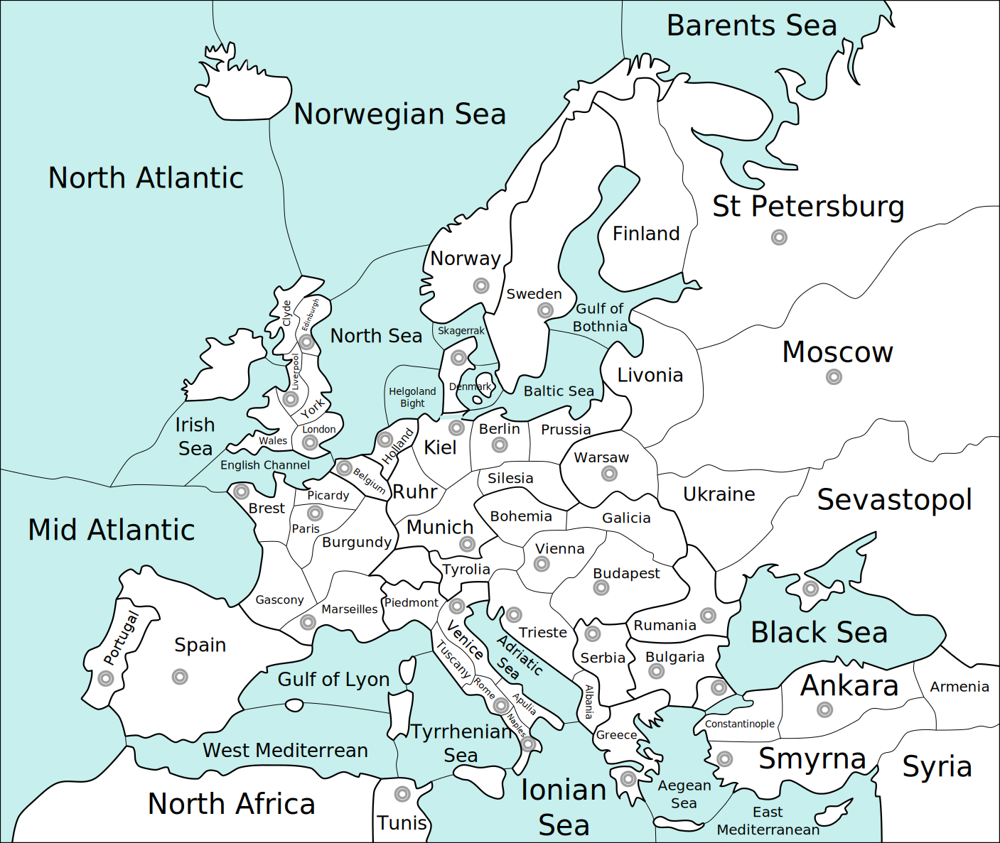

[](https://github.com/zond/godip/actions)
[](https://godoc.org/github.com/zond/godip)

godip
=====

A DATC compliant dippy judge in Go.

Tested against over 5000 real games played by humans.

For autogenerated documentation, see https://pkg.go.dev/github.com/zond/godip.

To run the DATC test cases:

```
cd classical
go test
```

To run the tests against the real human played games:

```
cd variants/classical/droidippy/games
tar xvf games.tar.bz2
cd ..
env DEBUG=true go test
```

The real game tests will likely die from timeout, to continue testing where it left off:

```
cd classical/droidippy
env DEBUG=true SKIP=game_xxxx.txt go test
```

### Web service

http://godip-adjudication.appspot.com/ hosts a free public adjudicator based on godip.

`GET http://godip-adjudication.appspot.com/` lists JSON for all supported variants.

Example:
```
$ curl http://godip-adjudication.appspot.com
{"Ancient Mediterranean":{"Name":"Ancient Mediterranean","Nations":["Rome","Greece","Egypt","Persia","Carthage"],"PhaseTypes":["Movement","Retreat","Adjustment"],"Seasons":["Spring","Fall"],"UnitTypes":["Army","Fleet"],"SVGVersion":"3","CreatedBy":"Don Hessong","Version":"","Description":"Five historical nations battle for dominance of the Mediterranean.","Rules":"Rules are as per classical Diplomacy, with a few parts of the map that have noteworthy connectivity. Baleares is an archipelago that can be occupied by armies or fleets. Armies may not move directly from the mainland to Baleares, and a fleet in Baleares is able to form part of a convoy chain. The canal between Athens and Sparta is passable for armies, and means that Athens only has a single coast. Similarly the canal in Byzantium, the Sicilian Straits and the River Nile. There is a four way connection between the Ausonian Sea, Messenian Sea, Gulf of Tacape and Libyan Sea. There is another four-way connection between Alexandria, Sinai, Thebes and the Gulf of Pelusium. The first to 18 supply centers is the winner."},"Canton":{"Name":"Canton","Nations":["Turkey","Britain","China","Holland","Japan","Russia","France"],"PhaseTypes":["Movement","Retreat","Adjustment"],"Seasons":["Spring","Fall"],"UnitTypes":["Army","Fleet"],"SVGVersion":"3","CreatedBy":"Paul Webb","Version":"3","Description":"Canton is a seven-player Diplomacy variant set in Asia at the beginning of the 20th century.  The \"Great Powers\" are Britain, China, France, Holland, Japan, Russia, and Turkey.  Return to this era and determine the fate of Asia.","Rules":"Canton follows the same general principles of Classic Diplomacy. Units can only be built on home (starting) home supply centers. Constantinople (Con) and Egypt (Egy) work as canals (same as Kiel in Classic). Four provinces have dual coasts: Damascus (South/West), Bulgaria (South/East), Siam (West/East) and Canton (South/East). Provinces without names are impassable."},"Chaos":{"Name":"Chaos","Nations":["Ankara","Belgium","Berlin","Brest","Budapest","Bulgaria","Constantinople","Denmark","Edinburgh","Greece","Holland","Kiel","Liverpool","London","Marseilles","Moscow","Munich","Naples","Norway","Paris","Portugal","Rome","Rumania","Serbia","Sevastopol","Smyrna","Spain","StPetersburg","Sweden","Trieste","Tunis","Venice","Vienna","Warsaw"],"PhaseTypes":["Movement","Retreat","Adjustment"],"Seasons":["Spring","Fall"],"UnitTypes":["Army","Fleet"],"SVGVersion":"1","CreatedBy":"Unknown","Version":"","Description":"The chaos variant is played by 34 players, each owning a single supply center on the standard Diplomacy map. The game starts in Winter of 1900 at the adjustment phase. Each player starts out choosing which type of unit they wish to build and progressing from there. When building units, a unit may be built at any owned supply center. To mitigate absent players, all supply centers without orders during the first adjustment will build armies by default.","Rules":"The first to 18 supply centers is the winner."},"Classical":{"Name":"Classical","Nations":["Austria","England","France","Germany","Italy","Turkey","Russia"],"PhaseTypes":["Movement","Retreat","Adjustment"],"Seasons":["Spring","Fall"],"UnitTypes":["Army","Fleet"],"SVGVersion":"5","CreatedBy":"Allan B. Calhamer","Version":"","Description":"The original game of Diplomacy.","Rules":"The first to 18 supply centers is the winner. See the Wikibooks article for how to play: https://en.wikibooks.org/wiki/Diplomacy/Rules"},"Cold War":{"Name":"Cold War","Nations":["USSR","NATO"],"PhaseTypes":["Movement","Retreat","Adjustment"],"Seasons":["Spring","Fall"],"UnitTypes":["Army","Fleet"],"SVGVersion":"2","CreatedBy":"Firehawk \u0026 Safari","Version":"2","Description":"NATO and the USSR fight each other to see which will be the dominant superpower.","Rules":"Rules are as per classical Diplomacy, but with a different map. The winner is the first to seventeen supply centers, which is slightly more than half. Indonesia is connected to Australia and the Phillipines by bridges which allow armies and fleets to travel between them. Panama, Egypt and Istanbul contain canals, which allows fleets to enter and exit from either side. Denmark and Sweden are single coast provinces which fleets and armies can move between. Fleets in the North Sea must move to one of these provinces to get to the Baltic. Fleets may only convoy if they are in all-sea provinces."},"Fleet Rome":{"Name":"Fleet Rome","Nations":["Austria","England","France","Germany","Italy","Turkey","Russia"],"PhaseTypes":["Movement","Retreat","Adjustment"],"Seasons":["Spring","Fall"],"UnitTypes":["Army","Fleet"],"SVGVersion":"1","CreatedBy":"Richard Sharp","Version":"","Description":"Classical Diplomacy, but Italy starts with a fleet in Rome.","Rules":"The first to 18 supply centers is the winner.  Rules are as per classical Diplomacy, but Italy starts with a fleet in Rome rather than an army."},"France vs Austria":{"Name":"France vs Austria","Nations":["Austria","France"],"PhaseTypes":["Movement","Retreat","Adjustment"],"Seasons":["Spring","Fall"],"UnitTypes":["Army","Fleet"],"SVGVersion":"1","CreatedBy":"","Version":"","Description":"A two player variant on the classical map.","Rules":"The first to 18 supply centers is the winner. The rules are as per classical Diplomacy, but with only France and Austria."},"Hundred":{"Name":"Hundred","Nations":["England","Burgundy","France"],"PhaseTypes":["Movement","Retreat","Adjustment"],"Seasons":["Year"],"UnitTypes":["Army","Fleet"],"SVGVersion":"2","CreatedBy":"Andy Schwarz","Version":"3","Description":"A three player variant based on the Hundred Years War.","Rules":"A 'build anywhere' variant (players can build in any vacant supply center they own) where three players compete to be the first to 9 centers. The map is fairly standard except London is directly connected to Calais (for all units) and Northumbria and Aragon each have two coasts. France starts with five units but only four centers, so they will have to disband unless they gain a center by the end of 1430. The variant replaces Spring and Fall from the Classical game with years ending in '5' and years ending in '0' - i.e. there is an adjustment phase at the end of years ending in '0'."},"North Sea Wars":{"Name":"North Sea Wars","Nations":["Britons","Romans","Frysians","Norse"],"PhaseTypes":["Movement","Retreat","Adjustment"],"Seasons":["Spring","Fall"],"UnitTypes":["Army","Fleet"],"SVGVersion":"1","CreatedBy":"sqrg","Version":"1","Description":"A battle for trade routes in the North Sea.","Rules":"Standard rules, but with the following exceptions. The Central North Sea is a split region, connected to three trade centers - Wood, Iron and Grain. Players may move from the Central North Sea to claim any of these as if they were regular coastal regions. Units may move freely between these centers, but it is not possible for a unit to pass back in the opposite direction. Sealand is a coastal region with land access to all neighbouring spaces (including Limfjorden) and naval access to the east coast of Jutland, but not Amsivaria. The Irish Sea is inaccessible. The first player to 8 supply centers wins."},"Pure":{"Name":"Pure","Nations":["Austria","England","France","Germany","Italy","Turkey","Russia"],"PhaseTypes":["Movement","Retreat","Adjustment"],"Seasons":["Spring","Fall"],"UnitTypes":["Army"],"SVGVersion":"3","CreatedBy":"Danny Loeb","Version":"vb10","Description":"A very minimal version of classical Diplomacy where each country is a single province.","Rules":"Each of the seven nations has a single supply center, and each is adjacent to all of the others. The first player to own four of these centers is the winner."},"Twenty Twenty":{"Name":"Twenty Twenty","Nations":["Brazil","Canada","Australia","Italy","USA","Kenya","Egypt","Thailand","Turkey","South Africa","India","Russia","Pakistan","China","UK","Japan","Germany","Argentina","Nigeria","Spain"],"PhaseTypes":["Movement","Retreat","Adjustment"],"Seasons":["Spring","Fall"],"UnitTypes":["Army","Fleet"],"SVGVersion":"6","CreatedBy":"TTTPPP","Version":"1","Description":"Twenty nations compete to conquer the world by the year 2020.","Rules":"The rules are mostly standard. Nations may build in any captured home centers (note - they may not build in captured neutral supply centers). To win a nation needs to own more supply centers than any opponent. In the first year they need 20 more supply centers than any other player, but this target is reduced by 1 each year. So to win in the year 2015 a player needs at least 6 more supply centers than any other player, and in 2020 and beyond they need a lead of a single supply center. Alternatively, if a player manages to get to 49 centers (i.e. they own over half the map) then they automatically win. The game can only be won in the adjustment phase at the end of a year. There are six bridges connecting regions for armies (and fleets). These are Anchorage-Vladivostok, New Orleans-Cuba, Cuba-Dominican Republic, Ethiopia-Yemen, Korea-Nagisaki and Indonesia-Darwin. Thirteen regions have multiple coasts. These are Whitehorse, Los Angeles, Mexico, Colombia, Bordeaux, Milan, Rome, Finland, Bulgaria, Ankara, Iraq, Mecca and Shanyang."},"Vietnam War":{"Name":"Vietnam War","Nations":["North Vietnam","Thailand","South Vietnam","Cambodia","Laos"],"PhaseTypes":["Movement","Retreat","Adjustment"],"Seasons":["Spring","Fall"],"UnitTypes":["Army","Fleet"],"SVGVersion":"2","CreatedBy":"ThePolice","Version":"1.12","Description":"Indochina Peninsula at the beginning of Vietnam War in 1955.","Rules":"Rules are the same as classical Diplomacy, but with a different map. The winner is the first to fifteen provinces which is slightly more than half. All provinces connected to Mekong river are coastal; those are: Xuyen, Mekong, Pakxe and Ubon. That means Laos is able to build fleets in Pakxe. Xuyen has two coasts, as does Mekong (south coast and the river)."},"Western World 901":{"Name":"Western World 901","Nations":["Umayyad Emirate","Principality of Kiev","Kingdom of Denmark","Khaganate of Khazaria","West Frankish Kingdom","Tulunid Emirate","Abbasid Caliphate","East Frankish Kingdom","Eastern Roman Empire"],"PhaseTypes":["Movement","Retreat","Adjustment"],"Seasons":["Spring","Fall"],"UnitTypes":["Army","Fleet"],"SVGVersion":"2","CreatedBy":"David Cohen","Version":"4.0","Description":"Nine powers compete for the Western World circa 901.","Rules":"Rules are per standard Diplomacy except that nations may build in any vacant supply center they own. Each neutral supply center has a neutral army in it that will hold, or if dislodged then it will disband. If a neutral center is unowned in an adjustment phase then army will be rebuilt. Note that five regions have two coasts (Saamiland, Veletia, Jorvik, Rome and Pechenega) and Constantinople has a canal as in the standard map. There is no connection for fleets from the Khazar Sea to other sea regions. The winner is the first to own 33 of the 64 supply centers."},"Youngstown Redux":{"Name":"Youngstown Redux","Nations":["Turkey","Austria","Britain","China","Japan","Italy","Germany","India","Russia","France"],"PhaseTypes":["Movement","Retreat","Adjustment"],"Seasons":["Spring","Fall"],"UnitTypes":["Army","Fleet"],"SVGVersion":"2","CreatedBy":"airborne","Version":"I","Description":"A ten player variant that adds China, India and Japan to the standard seven nations.","Rules":"Rules are as per classical Diplomacy. There are eight box sea regions which are each connected to the other boxes in the same row and column, and allow fleets to travel 'around the world'. Six provinces have two coasts (Spain, St. Petersburg, Levant, Arabia, Hebei and Thailand), and all other coastal regions have a single coast. Note that the frozen Arctic region is impassible and prevents fleets from reaching Omsk and Siberia. The winner is the first nation to 28 supply centers, or the player with the most in the case of multiple nations reaching 28 in the same turn. If the leading two nations both have the same number of centers then the game will continue for another year. This variant is based on the Youngstown variant by Rod Walker, A. Phillips, Ken Lowe and Jon Monsarret."}}
```

`GET http://godip-adjudication.appspot.com/{variant name}` lists JSON for a starting map for the named variant.

Example:
```
$ curl http://godip-adjudication.appspot.com/Classical
{"Season":"Spring","Year":1901,"Type":"Movement","Units":{"ank":{"Type":"Fleet","Nation":"Turkey"},"ber":{"Type":"Army","Nation":"Germany"},"bre":{"Type":"Fleet","Nation":"France"},"bud":{"Type":"Army","Nation":"Austria"},"con":{"Type":"Army","Nation":"Turkey"},"edi":{"Type":"Fleet","Nation":"England"},"kie":{"Type":"Fleet","Nation":"Germany"},"lon":{"Type":"Fleet","Nation":"England"},"lvp":{"Type":"Army","Nation":"England"},"mar":{"Type":"Army","Nation":"France"},"mos":{"Type":"Army","Nation":"Russia"},"mun":{"Type":"Army","Nation":"Germany"},"nap":{"Type":"Fleet","Nation":"Italy"},"par":{"Type":"Army","Nation":"France"},"rom":{"Type":"Army","Nation":"Italy"},"sev":{"Type":"Fleet","Nation":"Russia"},"smy":{"Type":"Army","Nation":"Turkey"},"stp/sc":{"Type":"Fleet","Nation":"Russia"},"tri":{"Type":"Fleet","Nation":"Austria"},"ven":{"Type":"Army","Nation":"Italy"},"vie":{"Type":"Army","Nation":"Austria"},"war":{"Type":"Army","Nation":"Russia"}},"Orders":{},"SupplyCenters":{"ank":"Turkey","ber":"Germany","bre":"France","bud":"Austria","con":"Turkey","edi":"England","kie":"Germany","lon":"England","lvp":"England","mar":"France","mos":"Russia","mun":"Germany","nap":"Italy","par":"France","rom":"Italy","sev":"Russia","smy":"Turkey","stp":"Russia","tri":"Austria","ven":"Italy","vie":"Austria","war":"Russia"},"Dislodgeds":{},"Dislodgers":{},"Bounces":{},"Resolutions":{}}
```

`POST http://godip-adjudication.appspot.com/{variant name}` expects the body to be JSON matching a state previously provided by the corresponding `GET` URL but with populated orders, and returns the next state JSON.

Example:
```
$ curl -X POST --data '{"Season":"Spring","Year":1901,"Type":"Movement","Units":{"ank":{"Type":"Fleet","Nation":"Turkey"},"ber":{"Type":"Army","Nation":"Germany"},"bre":{"Type":"Fleet","Nation":"France"},"bud":{"Type":"Army","Nation":"Austria"},"con":{"Type":"Army","Nation":"Turkey"},"edi":{"Type":"Fleet","Nation":"England"},"kie":{"Type":"Fleet","Nation":"Germany"},"lon":{"Type":"Fleet","Nation":"England"},"lvp":{"Type":"Army","Nation":"England"},"mar":{"Type":"Army","Nation":"France"},"mos":{"Type":"Army","Nation":"Russia"},"mun":{"Type":"Army","Nation":"Germany"},"nap":{"Type":"Fleet","Nation":"Italy"},"par":{"Type":"Army","Nation":"France"},"rom":{"Type":"Army","Nation":"Italy"},"sev":{"Type":"Fleet","Nation":"Russia"},"smy":{"Type":"Army","Nation":"Turkey"},"stp/sc":{"Type":"Fleet","Nation":"Russia"},"tri":{"Type":"Fleet","Nation":"Austria"},"ven":{"Type":"Army","Nation":"Italy"},"vie":{"Type":"Army","Nation":"Austria"},"war":{"Type":"Army","Nation":"Russia"}},"Orders":{},"SupplyCenters":{"ank":"Turkey","ber":"Germany","bre":"France","bud":"Austria","con":"Turkey","edi":"England","kie":"Germany","lon":"England","lvp":"England","mar":"France","mos":"Russia","mun":"Germany","nap":"Italy","par":"France","rom":"Italy","sev":"Russia","smy":"Turkey","stp":"Russia","tri":"Austria","ven":"Italy","vie":"Austria","war":"Russia"},"Dislodgeds":{},"Dislodgers":{},"Bounces":{},"Resolutions":{},"Orders":{"England":{"lon":["Move","eng"]}}}' http://godip-adjudication.appspot.com/Classical
{"Season":"Spring","Year":1901,"Type":"Retreat","Units":{"ank":{"Type":"Fleet","Nation":"Turkey"},"ber":{"Type":"Army","Nation":"Germany"},"bre":{"Type":"Fleet","Nation":"France"},"bud":{"Type":"Army","Nation":"Austria"},"con":{"Type":"Army","Nation":"Turkey"},"edi":{"Type":"Fleet","Nation":"England"},"eng":{"Type":"Fleet","Nation":"England"},"kie":{"Type":"Fleet","Nation":"Germany"},"lvp":{"Type":"Army","Nation":"England"},"mar":{"Type":"Army","Nation":"France"},"mos":{"Type":"Army","Nation":"Russia"},"mun":{"Type":"Army","Nation":"Germany"},"nap":{"Type":"Fleet","Nation":"Italy"},"par":{"Type":"Army","Nation":"France"},"rom":{"Type":"Army","Nation":"Italy"},"sev":{"Type":"Fleet","Nation":"Russia"},"smy":{"Type":"Army","Nation":"Turkey"},"stp/sc":{"Type":"Fleet","Nation":"Russia"},"tri":{"Type":"Fleet","Nation":"Austria"},"ven":{"Type":"Army","Nation":"Italy"},"vie":{"Type":"Army","Nation":"Austria"},"war":{"Type":"Army","Nation":"Russia"}},"Orders":{},"SupplyCenters":{"ank":"Turkey","ber":"Germany","bre":"France","bud":"Austria","con":"Turkey","edi":"England","kie":"Germany","lon":"England","lvp":"England","mar":"France","mos":"Russia","mun":"Germany","nap":"Italy","par":"France","rom":"Italy","sev":"Russia","smy":"Turkey","stp":"Russia","tri":"Austria","ven":"Italy","vie":"Austria","war":"Russia"},"Dislodgeds":{},"Dislodgers":{},"Bounces":{},"Resolutions":{"ank":"OK","ber":"OK","bre":"OK","bud":"OK","con":"OK","edi":"OK","kie":"OK","lon":"OK","lvp":"OK","mar":"OK","mos":"OK","mun":"OK","nap":"OK","par":"OK","rom":"OK","sev":"OK","smy":"OK","stp/sc":"OK","tri":"OK","ven":"OK","vie":"OK","war":"OK"}}
```

See https://github.com/zond/godip/tree/master/gae for exact implementation details.

### Variant support

Currently only a few variants are supported.

Many variants would, however, be simple to implement in godip, or using godip.

These are the truths that should be valid for such a variant to be godip compatible in a simple manner:

* There is a Map with Provinces.
 * Each Province can contain at most one Unit.
 * Each Province can contain at most one SupplyCenter.
* Each Province has one or more SubProvinces.
 * Each SubProvince has attributes, such as Sea, Land or Coast.
 * Each SubProvince has connections to other SubProvinces.
* There are Units with UnitType and Nation.
 * Each unit is in one SubProvince.
* There are SupplyCenters with Nation.
 * Each SupplyCenter is in one Province.
* There are Phases with Year, Season and PhaseType.
* Orders can vary greatly:
 * They can be valid only for certain Years, PhaseTypes or Seasons.
 * They can be valid only for certain UnitTypes.
 * They can be valid only for certain Map environments.
 * They can be valid only when certain other Orders are valid.
 * They can be valid only when certain Units are present.

#### Map format

Most variants require a new map to be created. There is some variant creation tooling in development, for which there are more detailed instructions [here](variants/generator/README.md). This tool has been used to help create several variants, including Cold War and Youngstown Redux.

Maps are svg files and can be created with a combination of the free tool [Inkscape](https://inkscape.org/en/) and your favourite text editor.  The file should contain a pattern with id "stripes", which can be used by the client to highlight regions that the player can select.  The file should have at least the following layers in it:

 * The background (bottom layer): This should contain regions in the colour they should be when not owned.
 * Provinces with `id="provinces"`: This should be a hidden layer (`style="display:none"`) containing each province. When a province is owned then it will be revealed and coloured appropriately. Each province should have its id set to the appropriate abbreviation (e.g. in the classical game the "London" region has the id "lon"). There should also be an extra transparent province for each coast (i.e. in the classical game "St. Petersburg" has two transparent coastal regions "stp/nc" and "stp/sc").
 * Supply centers with `id="supply-centers"`: This is a layer of markers for supply centers. Each supply center should have the id set to the province name concatenated with "Center" (e.g. the supply center for "London" has the id "lonCenter"). These markers are used to position units and when drawing order symbols on the map.
 * Province centers with `id="province-centers"`: This is a similar layer of markers, but for the regions which aren't supply centers.  There should also be a center here for any subprovince (e.g. St. Petersberg North Coast has a center with id "stp/ncCenter").  The markers should follow the same naming convention as the supply center layer, but each marker should contain `fill:none;stroke:none;` in its style attribute so that it isn't displayed.
 * Highlights layer with `id="highlights"`: This is used to highlight selectable regions.
 * Names layer with `id="names"`: A layer containing text so the player knows what each region is called.
 * Units layer with `id="units"`: This will be empty in the map file.
 * Orders layer with `id="orders"`: This will also be empty in the map file.

Currently the [script](https://github.com/zond/diplicity/blob/master/app/js/dippymap.js) to handle map manipulation does not cope well with [transform](https://developer.mozilla.org/en/docs/Web/SVG/Attribute/transform) attributes.
To remove these attributes from the svg use one of the [methods on this page](https://stackoverflow.com/questions/13329125/removing-transforms-in-svg-files).

To prepare the svg file for use by go, the tool [go-bindata](https://github.com/jteeuwen/go-bindata) can be used. For example the command `go-bindata -pkg variants ./svg` will convert all assets in the svg directory into a script in the package "variants".

#### Map style

The Classical map is based on an [original work by trampolinebears](https://www.reddit.com/r/diplomacy/comments/8gx4ao/diplomacy_map/).



### Coloring non-SC provinces

Since godip is just an adjudicator, and coloring non-supply center provinces has nothing to do with rules or adjudication, it doesn't support this feature. However, https://github.com/Wulfheart/godip-influence provides support for this on top of godip.

### Algorithm

Heavily inspired by [The Math of Adjudication](http://www.diplom.org/Zine/S2009M/Kruijswijk/DipMath_Chp1.htm) by Lucas Kruijswijk.

Res(x) is https://github.com/zond/godip/blob/master/state/resolver.go.

Adj(x) is defined in each order type.

Example runs:

#### 6.C.3. TEST CASE, A DISRUPTED THREE ARMY CIRCULAR MOVEMENT
```
Running 6.C.3
Res(bul) (deps [])
  Adj(bul)
    'bul Move con' vs 'ank Move con': 1
    H2HDisl(con)
    Not dislodged
    'ank Move con' vs 'bul Move con': 1
  bul: Failure: ErrBounce:ank
  No guessing, resolving bul
bul: Failure: ErrBounce:ank (deps [])
Res(ank) (deps [])
  Adj(ank)
    'ank Move con' vs 'bul Move con': 1
    H2HDisl(con)
    Not dislodged
    'bul Move con' vs 'ank Move con': 1
  ank: Failure: ErrBounce:bul
  No guessing, resolving ank
ank: Failure: ErrBounce:bul (deps [])
Res(con) (deps [])
  Adj(con)
    'con Move smy' vs 'smy Move ank': 1
    Esc(smy)
      Res(smy) (deps [])
        Adj(smy)
          'smy Move ank' vs 'ank Move con': 1
          Esc(ank)
            Res(ank) (deps [])
              Resolved
            ank: Failure: ErrBounce:bul (deps [])
          Failure: ErrBounce:bul
        smy: Failure: ErrBounce:ank
        No guessing, resolving smy
      smy: Failure: ErrBounce:ank (deps [])
    Failure: ErrBounce:ank
  con: Failure: ErrBounce:smy
  No guessing, resolving con
con: Failure: ErrBounce:smy (deps [])
Res(smy) (deps [])
  Resolved
smy: Failure: ErrBounce:ank (deps [])
```

#### 6.F.16. TEST CASE, PANDIN'S PARADOX
```
Running 6.F.17 (Pandin's extended paradox)
Res(eng) (deps [])
  Adj(eng)
    Res(bel) (deps [])
      Adj(bel)
        Res(nth) (deps [])
          Adj(nth)
          nth: Success
          No guessing, resolving nth
        nth: Success (deps [])
        'bel Move eng' vs 'wal Move eng': 2
        Res(lon) (deps [])
          Adj(lon)
            Res(eng) (deps [])
              Already resolving eng, making negative guess
            eng: Failure: Negative guess (deps [eng])
            Res(eng) (deps [eng])
              Guessed
            eng: Failure: Negative guess (deps [eng])
            Res(eng) (deps [eng])
              Guessed
            eng: Failure: Negative guess (deps [eng])
            Res(eng) (deps [eng])
              Guessed
            eng: Failure: Negative guess (deps [eng])
            Res(bre) (deps [eng])
              Adj(bre)
                Res(eng) (deps [eng])
                  Guessed
                eng: Failure: Negative guess (deps [eng])
                Res(eng) (deps [eng])
                  Guessed
                eng: Failure: Negative guess (deps [eng])
              bre: Failure: ErrMissignConvoyPath
            bre: Failure: ErrMissignConvoyPath (deps [eng])
          lon: Success
          Made new guess, adding lon to deps
        lon: Success (deps [eng lon])
        H2HDisl(eng)
        Not dislodged
        'wal Move eng' vs 'bel Move eng': 2
      bel: Failure: ErrBounce:wal
      Made new guess, adding bel to deps
    bel: Failure: ErrBounce:wal (deps [eng lon bel])
    Res(wal) (deps [eng lon bel])
      Adj(wal)
        Res(lon) (deps [eng lon bel])
          Adj(lon)
            Res(eng) (deps [eng lon bel])
              Guessed
            eng: Failure: Negative guess (deps [eng lon bel])
            Res(eng) (deps [eng lon bel])
              Guessed
            eng: Failure: Negative guess (deps [eng lon bel])
            Res(eng) (deps [eng lon bel])
              Guessed
            eng: Failure: Negative guess (deps [eng lon bel])
            Res(eng) (deps [eng lon bel])
              Guessed
            eng: Failure: Negative guess (deps [eng lon bel])
            Res(bre) (deps [eng lon bel])
              Adj(bre)
                Res(eng) (deps [eng lon bel])
                  Guessed
                eng: Failure: Negative guess (deps [eng lon bel])
                Res(eng) (deps [eng lon bel])
                  Guessed
                eng: Failure: Negative guess (deps [eng lon bel])
              bre: Failure: ErrMissignConvoyPath
            bre: Failure: ErrMissignConvoyPath (deps [eng lon bel])
          lon: Success
        lon: Success (deps [eng lon bel])
        'wal Move eng' vs 'bel Move eng': 2
        Res(nth) (deps [eng lon bel])
          Resolved
        nth: Success (deps [eng lon bel])
        H2HDisl(eng)
        Not dislodged
        'bel Move eng' vs 'wal Move eng': 2
      wal: Failure: ErrBounce:bel
    wal: Failure: ErrBounce:bel (deps [eng lon bel])
  eng: Success
  Guess made for eng, changing guess to positive
  Adj(eng)
    Res(bel) (deps [eng lon bel])
      Adj(bel)
        Res(nth) (deps [eng lon bel])
          Resolved
        nth: Success (deps [eng lon bel])
        'bel Move eng' vs 'wal Move eng': 2
        Res(lon) (deps [eng lon bel])
          Adj(lon)
            Res(eng) (deps [eng lon bel])
              Guessed
            eng: Success (deps [eng lon bel])
            Res(eng) (deps [eng lon bel])
              Guessed
            eng: Success (deps [eng lon bel])
            lon Support [wal eng]: broken by: [bre]
          lon: Failure: ErrSupportBroken:bre
        lon: Failure: ErrSupportBroken:bre (deps [eng lon bel])
        'wal Move eng' vs 'bel Move eng': 1
        Res(nth) (deps [eng lon bel])
          Resolved
        nth: Success (deps [eng lon bel])
        'bel Move eng' vs 'eng Convoy [bre lon]': 2
        'eng Convoy [bre lon]': 1
        Res(nth) (deps [eng lon bel])
          Resolved
        nth: Success (deps [eng lon bel])
        'bel Move eng' vs 'wal Move eng': 2
        Res(lon) (deps [eng lon bel])
          Adj(lon)
            Res(eng) (deps [eng lon bel])
              Guessed
            eng: Success (deps [eng lon bel])
            Res(eng) (deps [eng lon bel])
              Guessed
            eng: Success (deps [eng lon bel])
            lon Support [wal eng]: broken by: [bre]
          lon: Failure: ErrSupportBroken:bre
        lon: Failure: ErrSupportBroken:bre (deps [eng lon bel])
        'wal Move eng' vs 'bel Move eng': 1
      bel: Success
    bel: Success (deps [eng lon bel])
    Res(wal) (deps [eng lon bel])
      Adj(wal)
        Res(lon) (deps [eng lon bel])
          Adj(lon)
            Res(eng) (deps [eng lon bel])
              Guessed
            eng: Success (deps [eng lon bel])
            Res(eng) (deps [eng lon bel])
              Guessed
            eng: Success (deps [eng lon bel])
            lon Support [wal eng]: broken by: [bre]
          lon: Failure: ErrSupportBroken:bre
        lon: Failure: ErrSupportBroken:bre (deps [eng lon bel])
        'wal Move eng' vs 'bel Move eng': 1
        Res(nth) (deps [eng lon bel])
          Resolved
        nth: Success (deps [eng lon bel])
        H2HDisl(eng)
        Not dislodged
        'bel Move eng' vs 'wal Move eng': 2
      wal: Failure: ErrBounce:bel
    wal: Failure: ErrBounce:bel (deps [eng lon bel])
  eng: Failure: ErrConvoyDislodged:bel
  Calling backup rule with [eng lon bel]
  Calling backup rule for [eng lon bel]
  Res(eng) (deps [])
    Resolved
  eng: Failure: ErrConvoyParadox (deps [])
  No guessing, resolving eng
eng: Failure: ErrConvoyParadox (deps [])
Res(nth) (deps [])
  Resolved
nth: Success (deps [])
Res(bre) (deps [])
  Adj(bre)
    Res(eng) (deps [])
      Resolved
    eng: Failure: ErrConvoyParadox (deps [])
    Res(eng) (deps [])
      Resolved
    eng: Failure: ErrConvoyParadox (deps [])
  bre: Failure: ErrMissignConvoyPath
  No guessing, resolving bre
bre: Failure: ErrMissignConvoyPath (deps [])
Res(wal) (deps [])
  Adj(wal)
    Res(lon) (deps [])
      Adj(lon)
        Res(eng) (deps [])
          Resolved
        eng: Failure: ErrConvoyParadox (deps [])
        Res(eng) (deps [])
          Resolved
        eng: Failure: ErrConvoyParadox (deps [])
        Res(eng) (deps [])
          Resolved
        eng: Failure: ErrConvoyParadox (deps [])
        Res(eng) (deps [])
          Resolved
        eng: Failure: ErrConvoyParadox (deps [])
        Res(bre) (deps [])
          Resolved
        bre: Failure: ErrMissignConvoyPath (deps [])
      lon: Success
      No guessing, resolving lon
    lon: Success (deps [])
    'wal Move eng' vs 'bel Move eng': 2
    Res(nth) (deps [])
      Resolved
    nth: Success (deps [])
    H2HDisl(eng)
    Not dislodged
    'bel Move eng' vs 'wal Move eng': 2
  wal: Failure: ErrBounce:bel
  No guessing, resolving wal
wal: Failure: ErrBounce:bel (deps [])
Res(lon) (deps [])
  Resolved
lon: Success (deps [])
Res(yor) (deps [])
  Adj(yor)
  yor: Success
  No guessing, resolving yor
yor: Success (deps [])
Res(bel) (deps [])
  Adj(bel)
    Res(nth) (deps [])
      Resolved
    nth: Success (deps [])
    'bel Move eng' vs 'wal Move eng': 2
    Res(lon) (deps [])
      Resolved
    lon: Success (deps [])
    H2HDisl(eng)
    Not dislodged
    'wal Move eng' vs 'bel Move eng': 2
  bel: Failure: ErrBounce:wal
  No guessing, resolving bel
bel: Failure: ErrBounce:wal (deps [])
```

